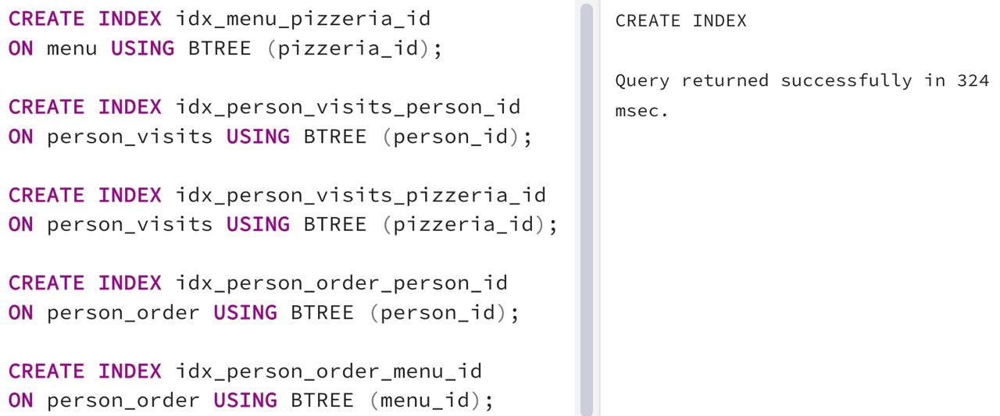

## Task - Let’s create indexes for every foreign key

**Please create a simple BTree index for each foreign key in our database. The name pattern should match the next rule `"idx_{table_name}_{column_name}"`. For example, the name of the BTree index for the pizzeria_id column in the menu table is idx_menu_pizzeria_id.**

RU: Cоздайте простые BTree индексы для каждого внешнего ключа в базе. Название паттерна должно соответствовать правилу: `"idx_{table_name}_{column_name}"`. Например, название BTree индекса для колонки `pizzeria_id` в таблице `menu` будет `idx_menu_pizzeria_id`.

\
*Схема*

\
*Решение*