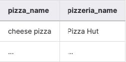
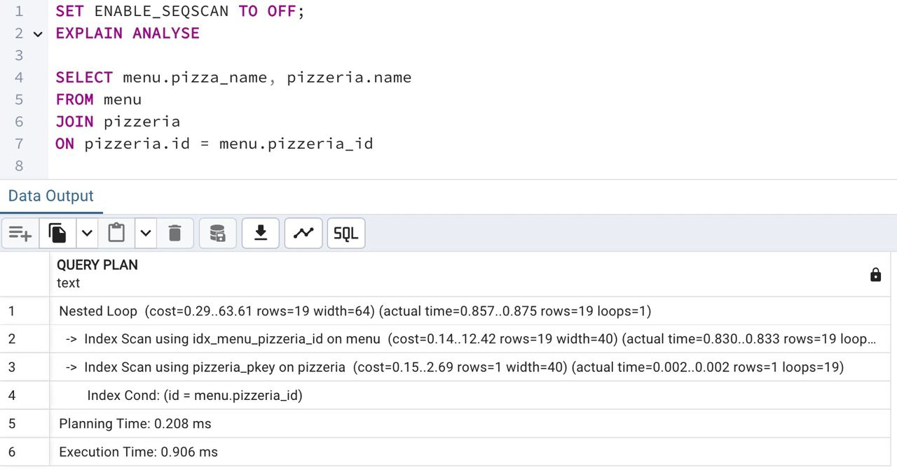

## Task - How to see that index works?

**Before proceeding, please write an SQL statement that returns pizzas and the corresponding pizzeria names. See the example result below (no sorting required).**

RU: Прежде чем продолжать, напишите SQL инструкцию, котоорая возвращает названия пицц и соответствующие названия пиццерий. Ориентируйтесь на пример ниже (сортировка не требуется):

\
*Пример*

\
*Схема*

\
*Решение*