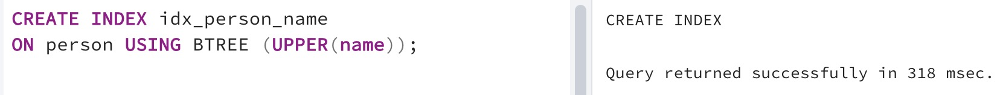

## Task - Formula is in the index. Is it Ok?

**Please create a functional B-Tree index  named `idx_person_name` on the column `name` of the `person` table. The index should contain person names in upper case.
Write and provide any SQL with proof (EXPLAIN ANALYZE) that index idx_person_name works.**

RU: Cоздайте функциональный B-Tree индекс, с названием: `idx_person_name` в колонке `name` в таблице `person`. Индекс должен содержать имя человека в верхнем регистре.

\
*Схема*

\
*Решение*