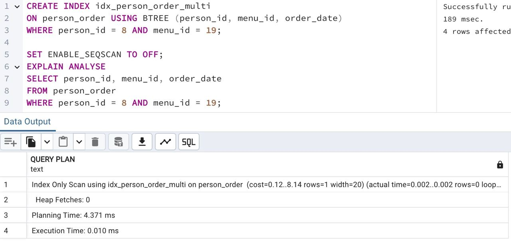

## Task - Multicolumn index for our goals

**Please create a better multi-column B-Tree index named `idx_person_order_multi` for the SQL statement below.**

```
SELECT person_id, menu_id, order_date
FROM person_order
WHERE person_id = 8 AND menu_id = 19;
```

**The `EXPLAIN ANALYZE` command should return the next pattern. Please pay attention to "Index Only Scan" scanning!**

```
Index Only Scan using idx_person_order_multi on person_order ...
```

**Provide any SQL with proof (EXPLAIN ANALYZE) that index `idx_person_order_multi` works.**

RU: Создайте B-Tree многостолбцовый индекс, с названием `idx_person_order_multi` для SQL-запроса из примера. С помощью `EXPLAIN ANALYZE` должен вернуться паттерн из примера. Предоставьте доказательство с помощью EXPLAIN ANALYZE, что индекс `idx_person_order_multi` работает.

\
*Схема*

\
*Решение*