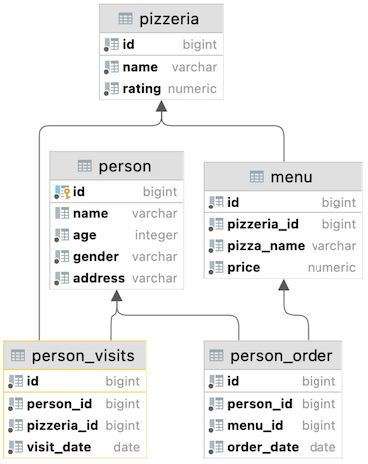
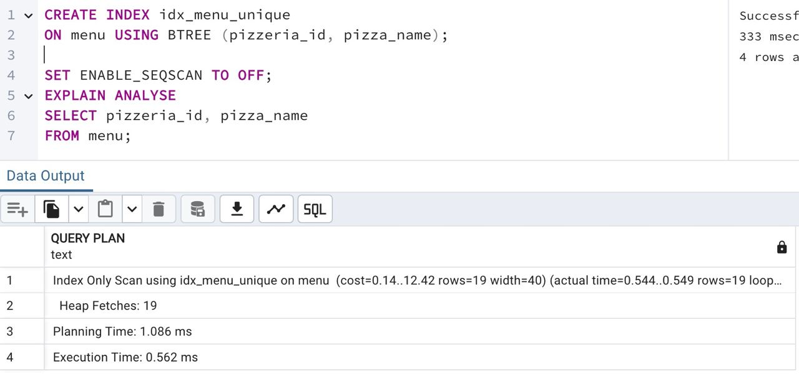

## Task - Uniqueness for data

**Please create a unique BTree index named `idx_menu_unique` on the `menu` table for `pizzeria_id` and `pizza_name` columns. Write and provide any SQL with proof (EXPLAIN ANALYZE) that index `idx_menu_unique` works.**

RU: Cоздайте уникальный BTree индекс с названием `idx_menu_unique` в таблице `menu` для столбцов `pizzeria_id` и `pizza_name`. Напишите и подтвердите SQL-запросом с помощью EXPLAIN ANALYZE, что индекс `idx_menu_unique` работает.

\
*Схема*

\
*Решение*