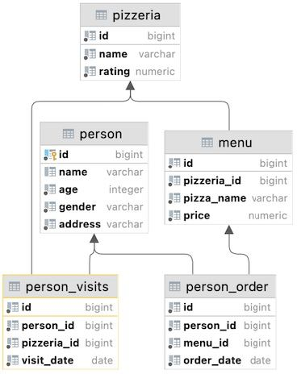
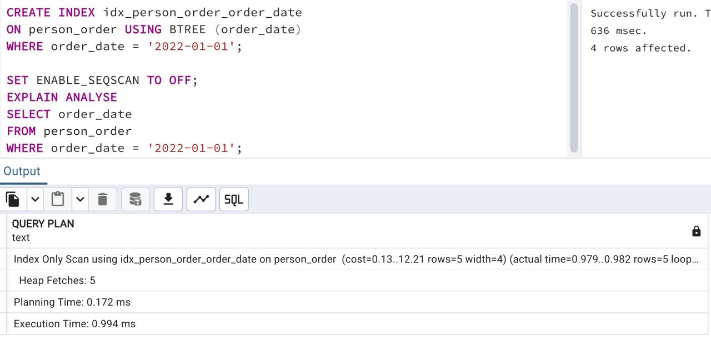

## Task - Partial uniqueness for data

**Please create a partially unique BTree index named `idx_person_order_order_date` on the `person_order` table for the `person_id` and `menu_id` attributes with partial uniqueness for the `order_date` column for the date `'2022-01-01'`.
The `EXPLAIN ANALYZE` command should return the next pattern.**

```
Index Only Scan using idx_person_order_order_date on person_order …
```

RU: Создайте уникальный BTree индекс с названием `idx_person_order_order_date`, в таблице `person_order` для колонок `person_id` и `menu_id` с частичным индексом для `order_date` для даты `2022-01-01`

\
*Схема*

\
*Решение*