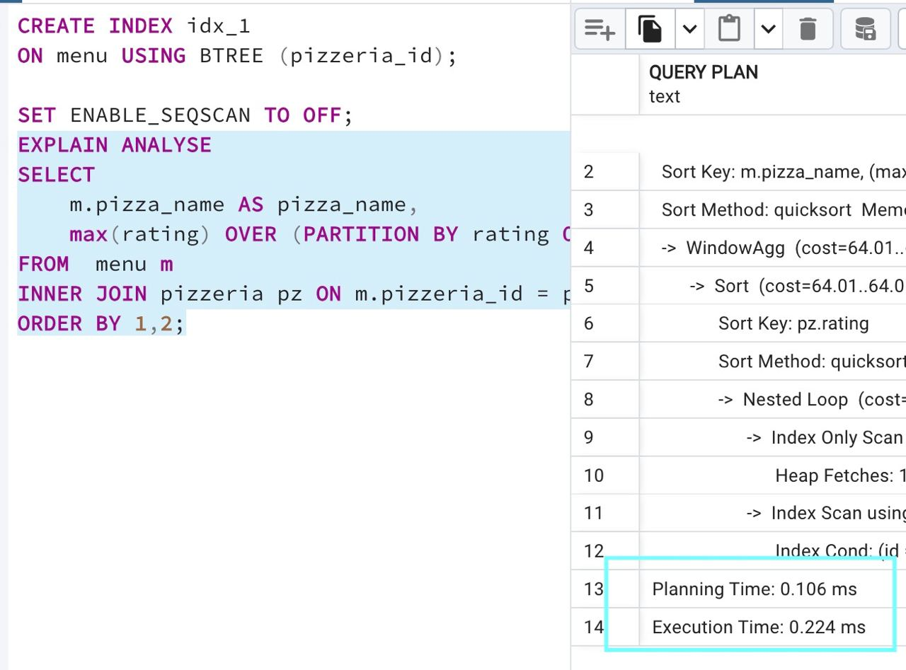
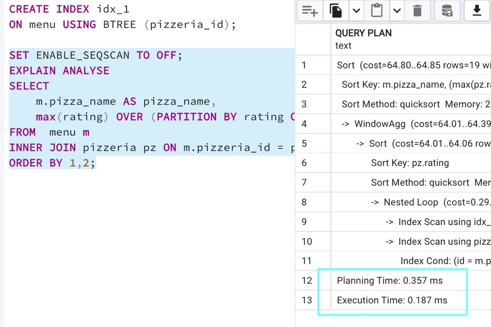

## Task - Let’s make performance improvement

**Take a look at the SQL below from a technical perspective (ignore a logical case of this SQL statement).**

```
SELECT
    m.pizza_name AS pizza_name,
    max(rating) OVER (PARTITION BY rating ORDER BY rating ROWS BETWEEN UNBOUNDED PRECEDING AND UNBOUNDED FOLLOWING) AS k
FROM  menu m
INNER JOIN pizzeria pz ON m.pizzeria_id = pz.id
ORDER BY 1,2;
```

**Create a new BTree index named `idx_1` that should improve the "Execution Time" metric of this SQL. Provide evidence (`EXPLAIN ANALYZE`) that the SQL has been improved.**
**Hint: This exercise looks like a "brute force" task to find a good cover index, so before your new test, remove the `idx_1` index.**
**Sample of my improvement:**
**Before:**

```
Sort  (cost=26.08..26.13 rows=19 width=53) (actual time=0.247..0.254 rows=19 loops=1)
"  Sort Key: m.pizza_name, (max(pz.rating) OVER (?))"
Sort Method: quicksort  Memory: 26kB
->  WindowAgg  (cost=25.30..25.68 rows=19 width=53) (actual time=0.110..0.182 rows=19 loops=1)
        ->  Sort  (cost=25.30..25.35 rows=19 width=21) (actual time=0.088..0.096 rows=19 loops=1)
            Sort Key: pz.rating
            Sort Method: quicksort  Memory: 26kB
            ->  Merge Join  (cost=0.27..24.90 rows=19 width=21) (actual time=0.026..0.060 rows=19 loops=1)
                    Merge Cond: (m.pizzeria_id = pz.id)
                    ->  Index Only Scan using idx_menu_unique on menu m  (cost=0.14..12.42 rows=19 width=22) (actual time=0.013..0.029 rows=19 loops=1)
                        Heap Fetches: 19
                    ->  Index Scan using pizzeria_pkey on pizzeria pz  (cost=0.13..12.22 rows=6 width=15) (actual time=0.005..0.008 rows=6 loops=1)
Planning Time: 0.711 ms
Execution Time: 0.338 ms
```

**After:**

```
Sort  (cost=26.28..26.33 rows=19 width=53) (actual time=0.144..0.148 rows=19 loops=1)
"  Sort Key: m.pizza_name, (max(pz.rating) OVER (?))"
Sort Method: quicksort  Memory: 26kB
->  WindowAgg  (cost=0.27..25.88 rows=19 width=53) (actual time=0.049..0.107 rows=19 loops=1)
        ->  Nested Loop  (cost=0.27..25.54 rows=19 width=21) (actual time=0.022..0.058 rows=19 loops=1)
            ->  Index Scan using idx_1 on …
            ->  Index Only Scan using idx_menu_unique on menu m  (cost=0.14..2.19 rows=3 width=22) (actual time=0.004..0.005 rows=3 loops=6)
…
Planning Time: 0.338 ms
Execution Time: 0.203 ms
```

RU: Игнорируя логическую составляющую, посмотрите на SQL-запрос в примере. Создайте новый BTree index с названием `idx_1`, который должен улучшить время выполнения запроса. Приведите доказательство.

\
*Схема*

\
*Время выполнения ДО создания индекса*

\
*Время выполнения ПОСЛЕ создания индекса*