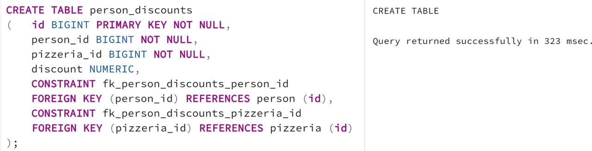

## Task - 

**Think about personal discounts for people from one side and pizza restaurants from the other. Need to create a new relational table (please set a name `person_discounts`) with the following rules.**
- **Set `id` attribute like a Primary Key (please have a look at `id` column in existing tables and choose the same data type).**
- **Set attributes person_id and pizzeria_id as foreign keys for corresponding tables (data types should be the same as for id columns in corresponding parent tables).**
- **Please set explicit names for foreign key constraints using the pattern `fk_{table_name}_{column_name}`, for example `fk_person_discounts_person_id`.**
- **Add a `discount` attribute to store a discount value in percent. Remember that the discount value can be a floating-point number (just use the numeric datatype). So please choose the appropriate datatype to cover this possibility.**

RU: Подумайте о персональных скидках для людей с одной стороны и о пиццериях с другой стороны. Нужно создать новую таблицу (`person_discounts`), следуя следующим правилам:
- нужно установить `id` в качестве главного ключа (обратите внимание на колонку `id` в существующей таблице и выберете тот же тип данных).
- нужно установить `person_id` и `pizzeria_id` в качестве внешних клюей для связанных таблиц (тип данных должен быть такой же как для колонки `id` из родительской таблицы)
- установите явные имена для внешних клюей, используя паттерн `fk_{table_name}_{column_name}`, например, `fk_person_discounts_person_id`. 
- добавьте параметр `discount`, для размера скидки в процентах (используйте просто числовой тип данных). Выберите подходящих тип данных, чтобы учесть эту возможность.

\
*Схема*

\
*Решение*