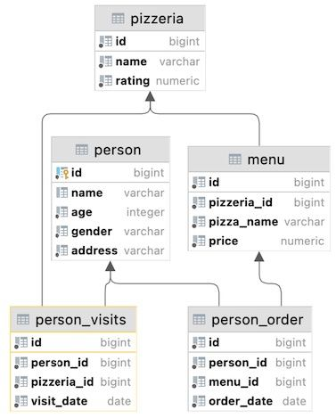

## Task - Let’s set personal discounts

**Actually, we have created a structure to store our discounts and we are ready to go further and fill our `person_discounts` table with new records.**
**So, there is a table `person_order` which stores the history of a person's orders. Please write a DML statement (`INSERT INTO ... SELECT ...`) that makes inserts new records into the `person_discounts` table based on the following rules.**
- **Take aggregated state from `person_id` and `pizzeria_id` columns.**
- **Calculate personal discount value by the next pseudo code:**
```
if “amount of orders” = 1 then “discount” = 10.5  else if “amount of orders” = 2 then  “discount” = 22 else  “discount” = 30
```

- **To create a primary key for the `person_discounts` table, use the following SQL construct (this construct is from the `WINDOW FUNCTION SQL` section).**

```
... ROW_NUMBER( ) OVER ( ) AS id ...**
```

RU: На самом деле, мы создали структуру для хранения наших скидок и мы уже готовы идти дальше и заполнить нашу таблицу `person_discounts` новыми данными. У нас есть таблица `person_order`, в которой хранится история заказов. Напишите DML-запрос (`INSERT INTO ... SELECT ...`), который вставит новые записи в таблицу `person_discounts`, основываясь на следующих записях:
- Берет подготовленные данные из колонок `person_id` и `pizzeria_id`
- Считает значение персональной скидки с помощью псевдокода из примера.
- Создает первичный ключ для таблицы `person_discounts`, используя следующую SQL-конструкцию.

\
*Схема*

\
*Решение*