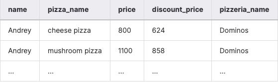
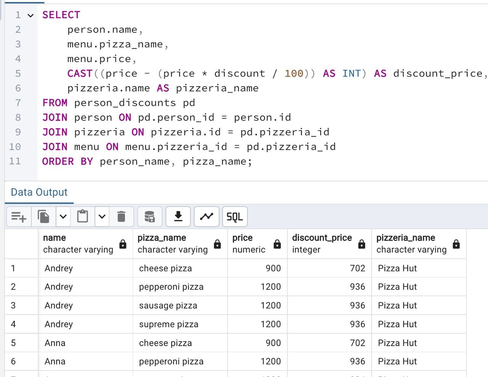

## Task - Let’s recalculate a history of orders

**Write a SQL statement that returns the orders with actual `price` and `price with discount` applied for each person in the corresponding pizzeria restaurant, sorted by `person name` and `pizza name`. Please see the sample data below.**

RU: Напишите SQL-запрос, который возвращает заказы с актуальной ценой и ценой со скидкой, название ресторана и имя человека. Отсортируйте по `person name` и `pizza name`.

\
*Пример*

\
*Схема*

\
*Решение*