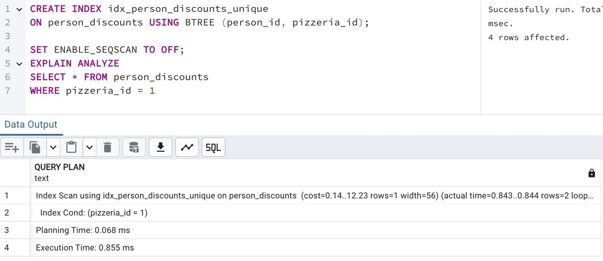

## Task - Improvements are in a way

**Actually, we need to improve data consistency from one side and performance tuning from the other side. Please create a multi-column unique index (named `idx_person_discounts_unique`) that prevents duplicates of the person and pizzeria identifier pairs.**
**After creating a new index, please provide any simple SQL statement that shows proof of the index usage (using `EXPLAIN ANALYZE`).**
**The proof example is below:**

```
...
Index Scan using idx_person_discounts_unique on person_discounts**
```

RU: Теперь нам нужно улучшить согласованность данных с одной стороны и производительность с другой стороны. Пожалуйста, создайте многостолбцовый индекс (с названием `idx_person_discounts_unique`), который предотвращает дублирование пар человек-пиццерия.
После создания индекса, приведите любой простой SQL-запрос, который подтвердит использования индекса (с использованием `EXPLAIN ANALYZE`).

\
*Схема*

\
*Решение*