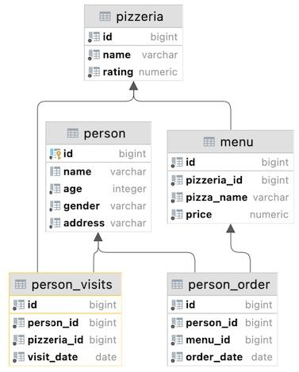
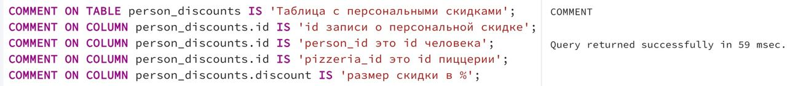

## Task - Data Governance Rules

**To comply with Data Governance Policies, you need to add comments for the table and the table's columns. Let's apply this policy to the `person_discounts` table. Please add English or Russian comments (it is up to you) explaining what is a business goal of a table and all its attributes.**

RU: Чтобы соответствовать политике управления данными, необходимо добавить комментарии к таблице и ее столбцам. Надо применить эту политику к таблице `person_discounts`. Добавьте комментарии на английском или русском языке, объясняющие, какова бизнес-цель таблицы и все ее атрибуты.

\
*Схема*

\
*Решение*