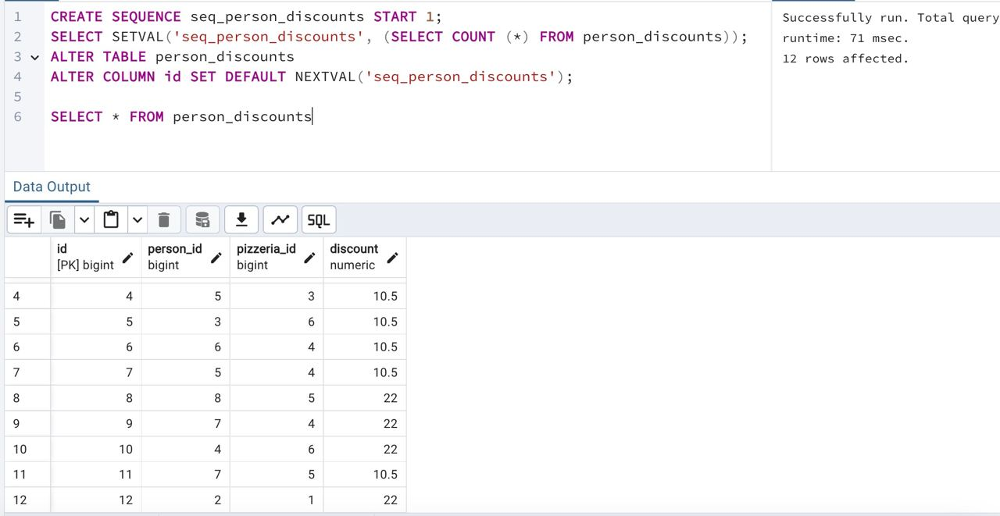

## Task - Let’s automate Primary Key generation

**Let’s create a Database Sequence named `seq_person_discounts` (starting with a value of 1) and set a default value for the `id` attribute of the `person_discounts` table to automatically take a value from `seq_person_discounts` each time.**
**Please note that your next sequence number is 1, in this case please set an actual value for database sequence based on formula "number of rows in person_discounts table" + 1. Otherwise you will get errors about Primary Key violation constraint.**

RU: Cоздайте генератор последовательности с названием `seq_person_discounts` (начинающийся со значения 1) и установите дефолтные значения для колонки `id` в таблице `person_discounts`, которые автоматически берут значения из `seq_person_discounts`. Обратите внимание, что ваш следующий порядковый номер равен 1, поэтому установите значение для последовательности, основываясь на формуле "количество строк в таблице + 1". В противном случае вы получите сообщение об ошибке, связанной с нарушением ограничения первичного ключа.

\
*Схема*

\
*Решение*